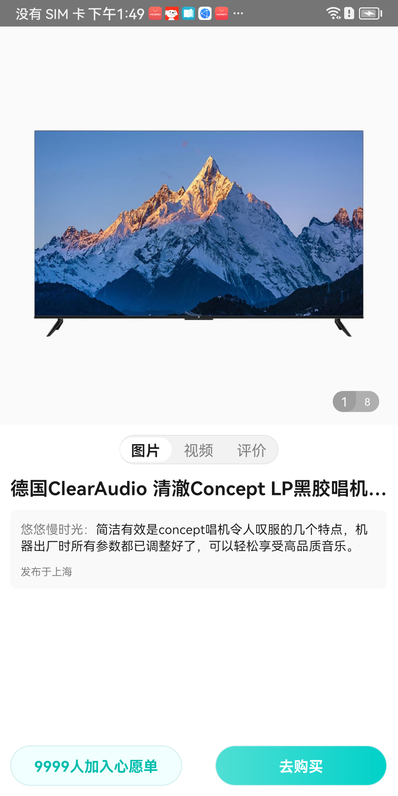
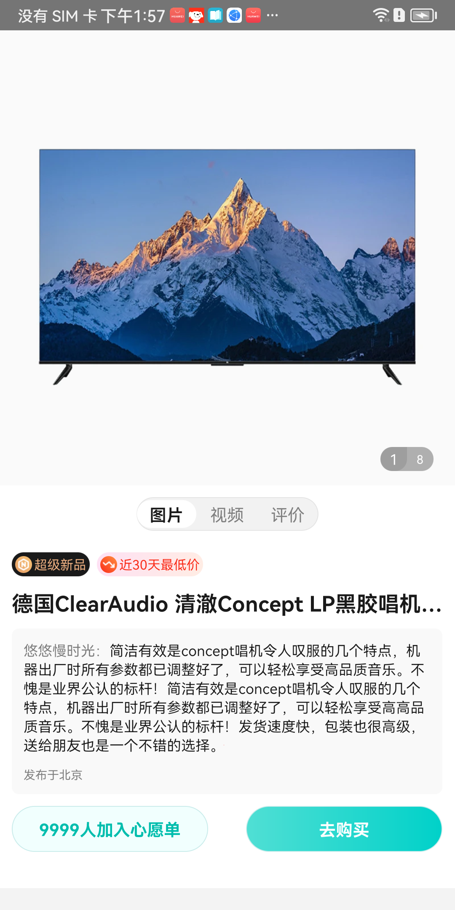
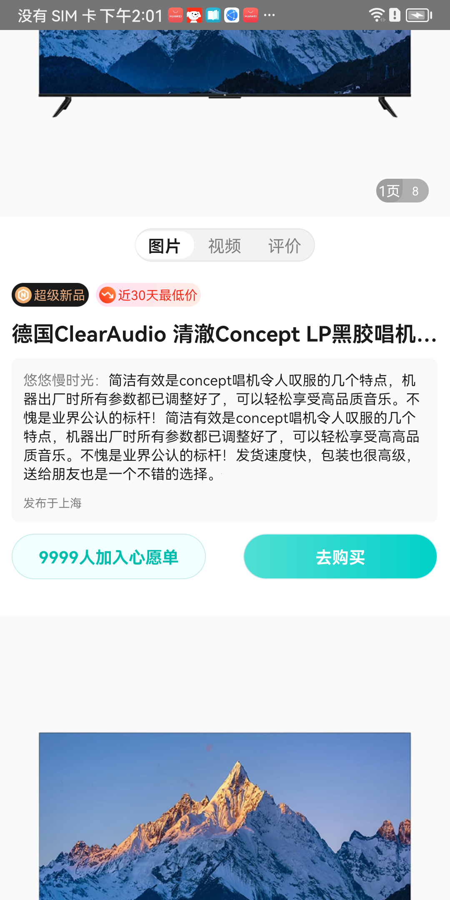
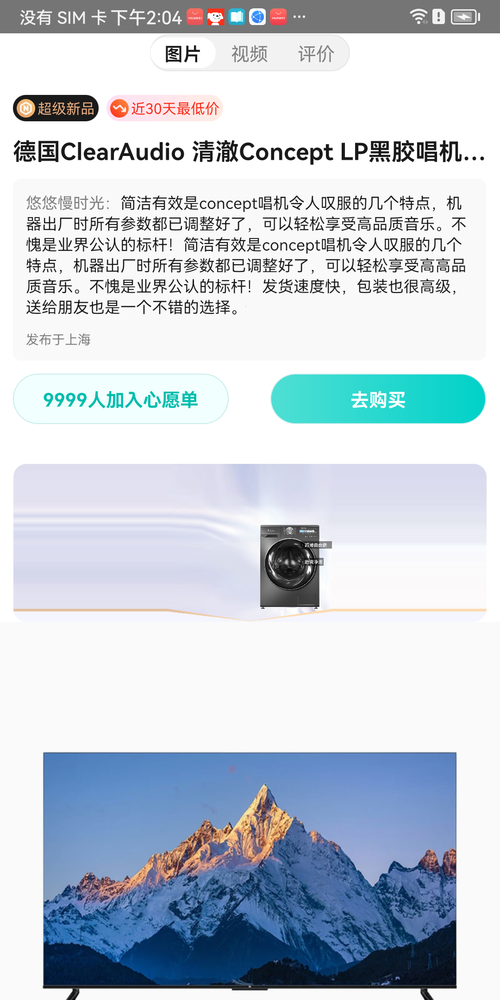
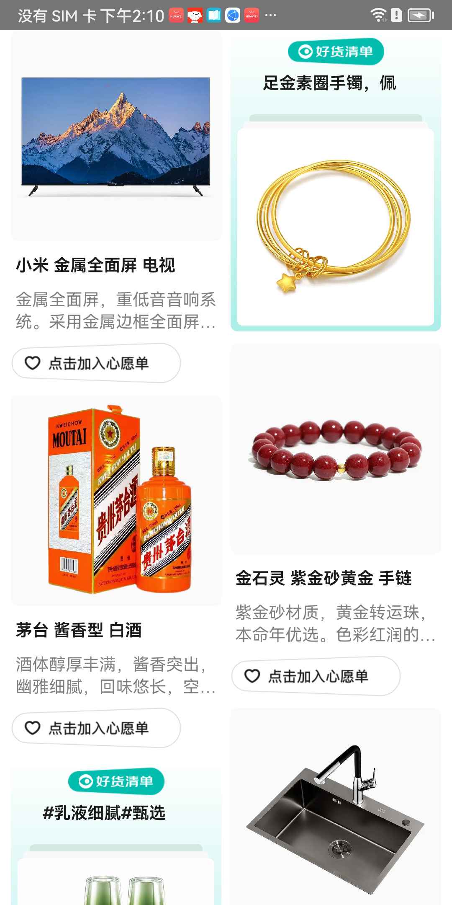
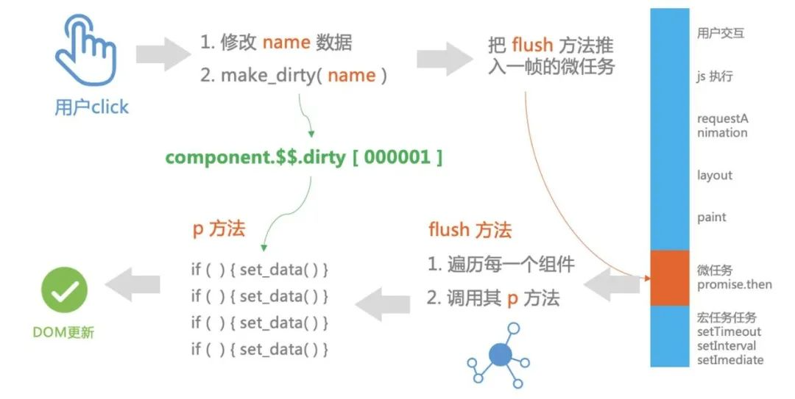

# DynamicZebra
一套Android原生轻动态化响应式开发框架，支持动态化开发

## 效果预览

上面是视频专为的gif图哈，看着有些卡顿，实际效果非常流畅。

## 1.普通模板


#### 实现方式
layout.xml
```
<?xml version="1.0" encoding="utf-8" ?>
<FlexBox alignItems="flex_start" background="#FFFFFF" flexDirection="column" height="100%"
    width="100%">

    <FlexBox aspectRatio="1" height="wrap_content" width="100%">
        <ImageView background="#DCDCDC" height="100%" scaleType="fit" src="{imgUrl}" width="100%" />

        <View background="rgba(0,0,0,0.02)" height="100%" positionType="absolute" width="100%" />

        <FlexBox background="rgba(0,0,0,0.3)" borderRadius="20rpx" flexDirection="row"
            height="wrap_content" positionBottom="24rpx" positionRight="36rpx"
            positionType="absolute" width="wrap_content">
            <TextView background="rgba(0,0,0,0.1)" borderRadius="20rpx 0 20rpx 20rpx"
                gravity="center" height="40rpx" text="1" textColor="#FFFFFF" textSize="24rpx"
                width="44rpx" />
            <TextView gravity="center" height="40rpx" text="8" textColor="#FFFFFF" textSize="20rpx"
                width="44rpx" />
        </FlexBox>
    </FlexBox>

    <FlexBox alignSelf="center" background="rgba(242,242,242,1)"
        border="2rpx solid rgba(0,0,0,0.08)" borderRadius="28rpx" height="56rpx"
        justifyContent="space_around" marginTop="20rpx" width="300rpx">
        <TextView alignSelf="center" background="rgba(255,255,255,1)" borderRadius="28rpx"
            gravity="center" height="46rpx" text="图片" textColor="rgba(26,26,26,1)" textSize="28rpx"
            textStyle="bold" width="98rpx" />
        <TextView alignSelf="center" borderRadius="28rpx" gravity="center" height="46rpx" text="视频"
            textColor="rgba(128,128,128,1)" textSize="28rpx" width="98rpx" />
        <TextView alignSelf="center" borderRadius="28rpx" gravity="center" height="46rpx" text="评价"
            textColor="rgba(128,128,128,1)" textSize="28rpx" width="98rpx" />
    </FlexBox>

    <TextView ellipsize="end" height="wrap_content" marginLeft="20rpx" marginRight="20rpx"
        marginTop="20rpx" maxLines="1" text="{title}" textColor="#1A1A1A" textSize="36rpx"
        textStyle="bold" width="710rpx" />

    <FlexBox background="#F9F9F9" borderRadius="12rpx" flexDirection="column"
        height="wrap_content" marginLeft="20rpx" marginRight="20rpx" marginTop="20rpx"
        width="710rpx">
        <TextView height="wrap_content" html="true" marginLeft="20rpx" marginRight="20rpx"
            marginTop="20rpx" text="{comment}" textColor="#1A1A1A" textSize="24rpx" width="670rpx" />
        <TextView height="wrap_content" marginLeft="20rpx" marginRight="20rpx" marginTop="20rpx"
            paddingBottom="20rpx" text="{ip}" textColor="rgba(128,128,128,1)" textSize="20rpx"
            width="wrap_content" />
    </FlexBox>

    <FlexBox height="wrap_content" justifyContent="space_between" positionBottom="20rpx"
        positionLeft="20rpx" positionRight="20rpx" positionType="absolute" width="710rpx">
        <TextView background="rgba(241,255,254,1)" border="2rpx solid rgba(202,236,235,1)"
            borderRadius="38rpx" gravity="center" height="76rpx" text="{likeStr}"
            textColor="rgba(0,189,173,1)" textSize="28rpx" textStyle="bold" width="324rpx" />
        <TextView background="linear-gradient(270deg, rgba(0,209,201,1),rgba(80,223,212,1))"
            border="2rpx solid rgba(202,236,235,1)" borderRadius="38rpx" gravity="center"
            height="76rpx" onClick="goBuy" text="去购买" textColor="rgba(255,255,255,1)"
            textSize="28rpx" textStyle="bold" width="324rpx" />
    </FlexBox>
</FlexBox>
```
business.js
```
function goBuy(e) {
    native.setState({ip:"发布于北京"});
    var requestParams = { "p1": "11" };
    native.request("goBuy", requestParams, function (e) {
        native.log("response:" + JSON.stringify(e.data));
        native.toast("购买成功");
    });
}

function onPageCreated(e) {
    native.log("response:onPageCreated");
}

function onPageStarted(e) {
    native.log("response:onPageStarted");
}

function onPageResumed(e) {
    native.log("response:onPageResumed");
}

function onPagePaused(e) {
    native.log("response:onPagePaused");
}

function onPageStopped(e) {
    native.log("response:onPageStopped");
}

function onPageDestroyed(e) {
    native.log("response:onPageDestroyed");
}
```
data.json
```
{
  "comment": "<font color='#808080'>悠悠慢时光：</font>简洁有效是concept唱机令人叹服的几个特点，机器出厂时所有参数都已调整好了，可以轻松享受高品质音乐。",
  "ip": "发布于上海",
  "title": "德国ClearAudio 清澈Concept LP黑胶唱机德国ClearAudio 清澈Concept LP黑胶唱机",
  "likeStr": "9999人加入心愿单",
  "imgUrl": "https://m.360buyimg.com/ceco/jfs/t1/173949/11/11316/481836/60aca377E9526779b/9e2f10b5bae1ae62.png.webp"
}
```

## 2.滚动模板


#### 实现方式
layout.xml
```
<?xml version="1.0" encoding="utf-8" ?>
<ScrollView background="rgba(0,0,0,0.03)" height="match_parent" width="match_parent">
    <FlexBox alignItems="flex_start" background="#FFFFFF" flexDirection="column"
        height="wrap_content" width="100%">

        <FlexBox aspectRatio="1" height="wrap_content" width="100%">
            <ImageView background="#DCDCDC" height="100%" scaleType="fit" src="{imgUrl}"
                width="100%" />

            <View background="rgba(0,0,0,0.02)" height="100%" positionType="absolute"
                width="100%" />

            <FlexBox background="rgba(0,0,0,0.3)" borderRadius="20rpx" flexDirection="row"
                height="wrap_content" positionBottom="24rpx" positionRight="36rpx"
                positionType="absolute" width="wrap_content">
                <TextView background="rgba(0,0,0,0.1)" borderRadius="20rpx 0 20rpx 20rpx"
                    gravity="center" height="40rpx" text="1" textColor="#FFFFFF" textSize="24rpx"
                    width="44rpx" />
                <TextView gravity="center" height="40rpx" text="8" textColor="#FFFFFF"
                    textSize="20rpx" width="44rpx" />
            </FlexBox>
        </FlexBox>

        <FlexBox alignSelf="center" background="rgba(242,242,242,1)"
            border="2rpx solid rgba(0,0,0,0.08)" borderRadius="28rpx" height="56rpx"
            justifyContent="space_around" marginTop="20rpx" width="300rpx">
            <TextView alignSelf="center" background="rgba(255,255,255,1)" borderRadius="28rpx"
                gravity="center" height="46rpx" text="图片" textColor="rgba(26,26,26,1)"
                textSize="28rpx" textStyle="bold" width="98rpx" />
            <TextView alignSelf="center" borderRadius="28rpx" gravity="center" height="46rpx"
                text="视频" textColor="rgba(128,128,128,1)" textSize="28rpx" width="98rpx" />
            <TextView alignSelf="center" borderRadius="28rpx" gravity="center" height="46rpx"
                text="评价" textColor="rgba(128,128,128,1)" textSize="28rpx" width="98rpx" />
        </FlexBox>

        <FlexBox height="wrap_content" marginLeft="20rpx" marginRight="20rpx" marginTop="36rpx"
            width="match_content">
            <FlexBox alignItems="center" background="rgba(26,26,26,1)" borderRadius="20rpx"
                height="40rpx" width="wrap_content">
                <FlexBox alignItems="center"
                    background="linear-gradient(225deg, rgba(249,196,118,1), rgba(229,157,102,1))"
                    borderRadius="14rpx" height="28rpx" justifyContent="center" marginLeft="6rpx"
                    width="28rpx">
                    <ImageView height="20rpx" scaleType="fit" src="assets://new.png"
                        width="20rpx" />
                </FlexBox>
                <TextView height="wrap_content" marginLeft="4rpx" marginRight="6rpx" text="超级新品"
                    textColor="rgba(234,173,127,1)" textSize="22rpx" width="wrap_content" />
            </FlexBox>
            <FlexBox alignItems="center"
                background="linear-gradient(135deg, rgba(245,49,180,0.15),rgba(255,133,72,0.15))"
                borderRadius="20rpx" height="40rpx" marginLeft="12rpx" width="wrap_content">
                <FlexBox alignItems="center"
                    background="linear-gradient(225deg, rgba(255,143,64,1),rgba(250,44,25,1))"
                    borderRadius="14rpx" height="28rpx" justifyContent="center" marginLeft="6rpx"
                    width="28rpx">
                    <ImageView height="20rpx" scaleType="fit" src="assets://low.png"
                        width="20rpx" />
                </FlexBox>
                <TextView height="wrap_content" marginLeft="4rpx" marginRight="6rpx" text="近30天最低价"
                    textColor="rgba(250,44,25,1)" textSize="22rpx" width="wrap_content" />
            </FlexBox>
        </FlexBox>

        <TextView ellipsize="end" height="wrap_content" marginLeft="20rpx" marginRight="20rpx"
            marginTop="20rpx" maxLines="1" text="{title}" textColor="#1A1A1A" textSize="36rpx"
            textStyle="bold" width="710rpx" />

        <FlexBox background="#F9F9F9" borderRadius="12rpx" flexDirection="column"
            height="wrap_content" marginLeft="20rpx" marginRight="20rpx" marginTop="20rpx"
            width="710rpx">
            <TextView height="wrap_content" html="true" marginLeft="20rpx" marginRight="20rpx"
                marginTop="20rpx" text="{comment}" textColor="#1A1A1A" textSize="24rpx" width="670rpx" />
            <TextView height="wrap_content" marginLeft="20rpx" marginRight="20rpx" marginTop="20rpx"
                paddingBottom="20rpx" text="{ip}" textColor="rgba(128,128,128,1)" textSize="20rpx"
                width="wrap_content" />
        </FlexBox>

        <FlexBox height="wrap_content" justifyContent="space_between" marginLeft="20rpx"
            marginRight="20rpx" marginTop="20rpx" width="710rpx">
            <TextView background="rgba(241,255,254,1)" border="2rpx solid rgba(202,236,235,1)"
                borderRadius="38rpx" gravity="center" height="76rpx" text="{likeStr}"
                textColor="rgba(0,189,173,1)" textSize="28rpx" textStyle="bold" width="324rpx" />
            <TextView background="linear-gradient(270deg, rgba(0,209,201,1),rgba(80,223,212,1))"
                border="2rpx solid rgba(202,236,235,1)" borderRadius="38rpx" gravity="center"
                height="76rpx" text="去购买" textColor="rgba(255,255,255,1)" textSize="28rpx"
                textStyle="bold" width="324rpx" onClick="goBuy"/>
        </FlexBox>
        <View height="60rpx" width="match_content" />
    </FlexBox>
</ScrollView>
```
business.js
```
function goBuy(e) {
    native.setState({ip:"发布于北京"});
    var requestParams = { "p1": "11" };
    native.request("goBuy", requestParams, function (e) {
        native.log("response:" + JSON.stringify(e.data));
        native.toast("购买成功");
    });
}

function onPageCreated(e) {
    native.log("response:onPageCreated");
}

function onPageStarted(e) {
    native.log("response:onPageStarted");
}

function onPageResumed(e) {
    native.log("response:onPageResumed");
}

function onPagePaused(e) {
    native.log("response:onPagePaused");
}

function onPageStopped(e) {
    native.log("response:onPageStopped");
}

function onPageDestroyed(e) {
    native.log("response:onPageDestroyed");
}
```
data.json
```
{
  "comment": "<font color='#808080'>悠悠慢时光：</font>简洁有效是concept唱机令人叹服的几个特点，机器出厂时所有参数都已调整好了，可以轻松享受高品质音乐。不愧是业界公认的标杆！简洁有效是concept唱机令人叹服的几个特点，机器出厂时所有参数都已调整好了，可以轻松享受高高品质音乐。不愧是业界公认的标杆！发货速度快，包装也很高级，送给朋友也是一个不错的选择。",
  "title": "德国ClearAudio 清澈Concept LP黑胶唱机德国ClearAudio 清澈Concept LP黑胶唱机",
  "ip": "发布于上海",
  "likeStr": "9999人加入心愿单",
  "imgUrl": "https://m.360buyimg.com/ceco/jfs/t1/173949/11/11316/481836/60aca377E9526779b/9e2f10b5bae1ae62.png.webp"
}
```

## 3.列表模板-单类型


#### 实现方式
layout.xml
```
<?xml version="1.0" encoding="utf-8" ?>
<RecyclerView background="#ffffff" for="{list}" height="match_parent" width="match_parent">
    <ItemView>
        <FlexBox alignItems="flex_start" background="#FFFFFF" flexDirection="column"
            height="wrap_content" width="match_content">
            <RecyclerView background="#ffffff" for="{@item.picList}" height="wrap_content"
                orientation="horizontal" width="match_parent">
                <ItemView>
                    <FlexBox height="wrap_content" width="match_parent">
                        <FlexBox aspectRatio="1" height="wrap_content" width="match_parent">
                            <ImageView background="#DCDCDC" height="100%" scaleType="fit"
                                src="{@item.imgUrl}"
                                width="100%" />

                            <View background="rgba(0,0,0,0.02)" height="100%"
                                positionType="absolute" width="100%" />

                            <FlexBox background="rgba(0,0,0,0.3)" borderRadius="20rpx"
                                flexDirection="row" height="wrap_content" positionBottom="24rpx"
                                positionRight="36rpx" positionType="absolute" width="wrap_content">
                                <TextView background="rgba(0,0,0,0.1)"
                                    borderRadius="20rpx 0 20rpx 20rpx" gravity="center"
                                    height="40rpx" text="{@position+1+'页'}" textColor="#FFFFFF" textSize="24rpx"
                                    width="44rpx" />
                                <TextView gravity="center" height="40rpx" text="8"
                                    textColor="#FFFFFF" textSize="20rpx" width="44rpx" />
                            </FlexBox>
                        </FlexBox>
                    </FlexBox>
                </ItemView>
            </RecyclerView>
            <FlexBox alignSelf="center" background="rgba(242,242,242,1)"
                border="2rpx solid rgba(0,0,0,0.08)" borderRadius="28rpx" height="56rpx"
                justifyContent="space_around" marginTop="20rpx" width="300rpx">
                <TextView alignSelf="center" background="rgba(255,255,255,1)" borderRadius="28rpx"
                    gravity="center" height="46rpx" text="图片" textColor="rgba(26,26,26,1)"
                    textSize="28rpx" textStyle="bold" width="98rpx" />
                <TextView alignSelf="center" borderRadius="28rpx" gravity="center" height="46rpx"
                    text="视频" textColor="rgba(128,128,128,1)" textSize="28rpx" width="98rpx" />
                <TextView alignSelf="center" borderRadius="28rpx" gravity="center" height="46rpx"
                    text="评价" textColor="rgba(128,128,128,1)" textSize="28rpx" width="98rpx" />
            </FlexBox>

            <FlexBox height="wrap_content" marginLeft="20rpx" marginRight="20rpx" marginTop="36rpx"
                width="match_content">
                <FlexBox alignItems="center" background="rgba(26,26,26,1)" borderRadius="20rpx"
                    height="40rpx" width="wrap_content">
                    <FlexBox alignItems="center"
                        background="linear-gradient(225deg, rgba(249,196,118,1), rgba(229,157,102,1))"
                        borderRadius="14rpx" height="28rpx" justifyContent="center"
                        marginLeft="6rpx" width="28rpx">
                        <ImageView height="20rpx" scaleType="fit" src="file://new.png"
                            width="20rpx" />
                    </FlexBox>
                    <TextView height="wrap_content" marginLeft="4rpx" marginRight="6rpx" text="超级新品"
                        textColor="rgba(234,173,127,1)" textSize="22rpx" width="wrap_content" />
                </FlexBox>
                <FlexBox alignItems="center"
                    background="linear-gradient(135deg, rgba(245,49,180,0.15),rgba(255,133,72,0.15))"
                    borderRadius="20rpx" height="40rpx" marginLeft="12rpx" width="wrap_content">
                    <FlexBox alignItems="center"
                        background="linear-gradient(225deg, rgba(255,143,64,1),rgba(250,44,25,1))"
                        borderRadius="14rpx" height="28rpx" justifyContent="center"
                        marginLeft="6rpx" width="28rpx">
                        <ImageView height="20rpx" scaleType="fit" src="file://low.png"
                            width="20rpx" />
                    </FlexBox>
                    <TextView height="wrap_content" marginLeft="4rpx" marginRight="6rpx"
                        text="近30天最低价" textColor="rgba(250,44,25,1)" textSize="22rpx"
                        width="wrap_content" />
                </FlexBox>
            </FlexBox>

            <TextView ellipsize="end" height="wrap_content" marginLeft="20rpx" marginRight="20rpx"
                marginTop="20rpx" maxLines="1" text="{@item.title}" textColor="#1A1A1A"
                textSize="36rpx" textStyle="bold" width="710rpx" />

            <FlexBox background="#F9F9F9" borderRadius="12rpx" flexDirection="column"
                height="wrap_content" marginLeft="20rpx" marginRight="20rpx" marginTop="20rpx"
                width="710rpx">
                <TextView height="wrap_content" html="true" marginLeft="20rpx" marginRight="20rpx"
                    marginTop="20rpx" text="{@item.comment}" textColor="#1A1A1A" textSize="24rpx"
                    width="670rpx" />
                <TextView height="wrap_content" marginLeft="20rpx" marginRight="20rpx"
                    marginTop="20rpx" paddingBottom="20rpx" text="{@item.ip}"
                    textColor="rgba(128,128,128,1)" textSize="20rpx" width="wrap_content" />
            </FlexBox>

            <FlexBox height="wrap_content" justifyContent="space_between" marginLeft="20rpx"
                marginRight="20rpx" marginTop="20rpx" width="710rpx">
                <TextView background="rgba(241,255,254,1)" border="2rpx solid rgba(202,236,235,1)"
                    borderRadius="38rpx" gravity="center" height="76rpx" text="{@item.likeStr}"
                    textColor="rgba(0,189,173,1)" textSize="28rpx" textStyle="bold"
                    width="324rpx" />
                <TextView background="linear-gradient(270deg, rgba(0,209,201,1),rgba(80,223,212,1))"
                    border="2rpx solid rgba(202,236,235,1)" borderRadius="38rpx" gravity="center"
                    height="76rpx" onClick="goBuy" text="去购买" textColor="rgba(255,255,255,1)"
                    textSize="28rpx" textStyle="bold" width="324rpx" />
            </FlexBox>
            <View height="60rpx" width="match_content" />
        </FlexBox>
    </ItemView>
</RecyclerView>
```
business.js
```
function goBuy(e) {
    var data = native.data();
    var position = e.data.position;
    data.list[position].ip="发布于北京";
    native.setState({list:data.list});

    var requestParams = { "p1": "11" };
    native.request("goBuy", requestParams, function (e) {
        native.log("response:" + JSON.stringify(e.data));
        native.toast("购买成功");
    });
}

function onPageCreated(e) {
    native.log("response:onPageCreated");
}

function onPageStarted(e) {
    native.log("response:onPageStarted");
}

function onPageResumed(e) {
    native.log("response:onPageResumed");
}

function onPagePaused(e) {
    native.log("response:onPagePaused");
}

function onPageStopped(e) {
    native.log("response:onPageStopped");
}

function onPageDestroyed(e) {
    native.log("response:onPageDestroyed");
}
```
data.json
```
{
  "list": [
    {
      "comment": "<font color='#808080'>悠悠慢时光：</font>简洁有效是concept唱机令人叹服的几个特点，机器出厂时所有参数都已调整好了，可以轻松享受高品质音乐。不愧是业界公认的标杆！简洁有效是concept唱机令人叹服的几个特点，机器出厂时所有参数都已调整好了，可以轻松享受高高品质音乐。不愧是业界公认的标杆！发货速度快，包装也很高级，送给朋友也是一个不错的选择。",
      "title": "德国ClearAudio 清澈Concept LP黑胶唱机德国ClearAudio 清澈Concept LP黑胶唱机",
      "ip": "发布于上海",
      "likeStr": "9999人加入心愿单",
      "picList": [{"imgUrl": "https://m.360buyimg.com/ceco/jfs/t1/173949/11/11316/481836/60aca377E9526779b/9e2f10b5bae1ae62.png.webp"},{"imgUrl": "https://m.360buyimg.com/ceco/jfs/t1/173949/11/11316/481836/60aca377E9526779b/9e2f10b5bae1ae62.png.webp"}]
    },
    {
      "comment": "<font color='#808080'>悠悠慢时光：</font>简洁有效是concept唱机令人叹服的几个特点，机器出厂时所有参数都已调整好了，可以轻松享受高品质音乐。不愧是业界公认的标杆！简洁有效是concept唱机令人叹服的几个特点，机器出厂时所有参数都已调整好了，可以轻松享受高高品质音乐。不愧是业界公认的标杆！发货速度快，包装也很高级，送给朋友也是一个不错的选择。",
      "title": "德国ClearAudio 清澈Concept LP黑胶唱机德国ClearAudio 清澈Concept LP黑胶唱机",
      "ip": "发布于上海",
      "likeStr": "9999人加入心愿单",
      "picList": [{"imgUrl": "https://m.360buyimg.com/ceco/jfs/t1/173949/11/11316/481836/60aca377E9526779b/9e2f10b5bae1ae62.png.webp"},{"imgUrl": "https://m.360buyimg.com/ceco/jfs/t1/173949/11/11316/481836/60aca377E9526779b/9e2f10b5bae1ae62.png.webp"}]
    },
    {
      "comment": "<font color='#808080'>悠悠慢时光：</font>简洁有效是concept唱机令人叹服的几个特点，机器出厂时所有参数都已调整好了，可以轻松享受高品质音乐。不愧是业界公认的标杆！简洁有效是concept唱机令人叹服的几个特点，机器出厂时所有参数都已调整好了，可以轻松享受高高品质音乐。不愧是业界公认的标杆！发货速度快，包装也很高级，送给朋友也是一个不错的选择。",
      "title": "德国ClearAudio 清澈Concept LP黑胶唱机德国ClearAudio 清澈Concept LP黑胶唱机",
      "ip": "发布于上海",
      "likeStr": "9999人加入心愿单",
      "picList": [{"imgUrl": "https://m.360buyimg.com/ceco/jfs/t1/173949/11/11316/481836/60aca377E9526779b/9e2f10b5bae1ae62.png.webp"},{"imgUrl": "https://m.360buyimg.com/ceco/jfs/t1/173949/11/11316/481836/60aca377E9526779b/9e2f10b5bae1ae62.png.webp"}]
    },
    {
      "comment": "<font color='#808080'>悠悠慢时光：</font>简洁有效是concept唱机令人叹服的几个特点，机器出厂时所有参数都已调整好了，可以轻松享受高品质音乐。不愧是业界公认的标杆！简洁有效是concept唱机令人叹服的几个特点，机器出厂时所有参数都已调整好了，可以轻松享受高高品质音乐。不愧是业界公认的标杆！发货速度快，包装也很高级，送给朋友也是一个不错的选择。",
      "title": "德国ClearAudio 清澈Concept LP黑胶唱机德国ClearAudio 清澈Concept LP黑胶唱机",
      "ip": "发布于上海",
      "likeStr": "9999人加入心愿单",
      "picList": [{"imgUrl": "https://m.360buyimg.com/ceco/jfs/t1/173949/11/11316/481836/60aca377E9526779b/9e2f10b5bae1ae62.png.webp"},{"imgUrl": "https://m.360buyimg.com/ceco/jfs/t1/173949/11/11316/481836/60aca377E9526779b/9e2f10b5bae1ae62.png.webp"}]
    },
    {
      "comment": "<font color='#808080'>悠悠慢时光：</font>简洁有效是concept唱机令人叹服的几个特点，机器出厂时所有参数都已调整好了，可以轻松享受高品质音乐。不愧是业界公认的标杆！简洁有效是concept唱机令人叹服的几个特点，机器出厂时所有参数都已调整好了，可以轻松享受高高品质音乐。不愧是业界公认的标杆！发货速度快，包装也很高级，送给朋友也是一个不错的选择。",
      "title": "德国ClearAudio 清澈Concept LP黑胶唱机德国ClearAudio 清澈Concept LP黑胶唱机",
      "ip": "发布于上海",
      "likeStr": "9999人加入心愿单",
      "picList": [{"imgUrl": "https://m.360buyimg.com/ceco/jfs/t1/173949/11/11316/481836/60aca377E9526779b/9e2f10b5bae1ae62.png.webp"},{"imgUrl": "https://m.360buyimg.com/ceco/jfs/t1/173949/11/11316/481836/60aca377E9526779b/9e2f10b5bae1ae62.png.webp"}]
    },
    {
      "comment": "<font color='#808080'>悠悠慢时光：</font>简洁有效是concept唱机令人叹服的几个特点，机器出厂时所有参数都已调整好了，可以轻松享受高品质音乐。不愧是业界公认的标杆！简洁有效是concept唱机令人叹服的几个特点，机器出厂时所有参数都已调整好了，可以轻松享受高高品质音乐。不愧是业界公认的标杆！发货速度快，包装也很高级，送给朋友也是一个不错的选择。",
      "title": "德国ClearAudio 清澈Concept LP黑胶唱机德国ClearAudio 清澈Concept LP黑胶唱机",
      "ip": "发布于上海",
      "likeStr": "9999人加入心愿单",
      "picList": [{"imgUrl": "https://m.360buyimg.com/ceco/jfs/t1/173949/11/11316/481836/60aca377E9526779b/9e2f10b5bae1ae62.png.webp"},{"imgUrl": "https://m.360buyimg.com/ceco/jfs/t1/173949/11/11316/481836/60aca377E9526779b/9e2f10b5bae1ae62.png.webp"}]
    }
  ]
}
```

## 4.列表模板-多类型


#### 实现方式
layout.xml
```
<?xml version="1.0" encoding="utf-8" ?>
<RecyclerView background="#ffffff" for="{list}" height="match_parent" width="match_parent">
    <ItemView viewType="0">
        <FlexBox alignItems="flex_start" background="#FFFFFF" flexDirection="column"
            height="wrap_content" width="match_content">
            <FlexBox aspectRatio="1" height="wrap_content" width="100%">
                <ImageView background="#DCDCDC" height="100%" scaleType="fit" src="{@item.imgUrl}"
                    width="100%" />

                <View background="rgba(0,0,0,0.02)" height="100%" positionType="absolute"
                    width="100%" />

                <FlexBox background="rgba(0,0,0,0.3)" borderRadius="20rpx" flexDirection="row"
                    height="wrap_content" positionBottom="24rpx" positionRight="36rpx"
                    positionType="absolute" width="wrap_content">
                    <TextView background="rgba(0,0,0,0.1)" borderRadius="20rpx 0 20rpx 20rpx"
                        gravity="center" height="40rpx" text="1" textColor="#FFFFFF"
                        textSize="24rpx" width="44rpx" />
                    <TextView gravity="center" height="40rpx" text="8" textColor="#FFFFFF"
                        textSize="20rpx" width="44rpx" />
                </FlexBox>
            </FlexBox>

            <FlexBox alignSelf="center" background="rgba(242,242,242,1)"
                border="2rpx solid rgba(0,0,0,0.08)" borderRadius="28rpx" height="56rpx"
                justifyContent="space_around" marginTop="20rpx" width="300rpx">
                <TextView alignSelf="center" background="rgba(255,255,255,1)" borderRadius="28rpx"
                    gravity="center" height="46rpx" text="图片" textColor="rgba(26,26,26,1)"
                    textSize="28rpx" textStyle="bold" width="98rpx" />
                <TextView alignSelf="center" borderRadius="28rpx" gravity="center" height="46rpx"
                    text="视频" textColor="rgba(128,128,128,1)" textSize="28rpx" width="98rpx" />
                <TextView alignSelf="center" borderRadius="28rpx" gravity="center" height="46rpx"
                    text="评价" textColor="rgba(128,128,128,1)" textSize="28rpx" width="98rpx" />
            </FlexBox>

            <FlexBox height="wrap_content" marginLeft="20rpx" marginRight="20rpx" marginTop="36rpx"
                width="match_content">
                <FlexBox alignItems="center" background="rgba(26,26,26,1)" borderRadius="20rpx"
                    height="40rpx" width="wrap_content">
                    <FlexBox alignItems="center"
                        background="linear-gradient(225deg, rgba(249,196,118,1), rgba(229,157,102,1))"
                        borderRadius="14rpx" height="28rpx" justifyContent="center"
                        marginLeft="6rpx" width="28rpx">
                        <ImageView height="20rpx" scaleType="fit" src="assets://new.png"
                            width="20rpx" />
                    </FlexBox>
                    <TextView height="wrap_content" marginLeft="4rpx" marginRight="6rpx" text="超级新品"
                        textColor="rgba(234,173,127,1)" textSize="22rpx" width="wrap_content" />
                </FlexBox>
                <FlexBox alignItems="center"
                    background="linear-gradient(135deg, rgba(245,49,180,0.15),rgba(255,133,72,0.15))"
                    borderRadius="20rpx" height="40rpx" marginLeft="12rpx" width="wrap_content">
                    <FlexBox alignItems="center"
                        background="linear-gradient(225deg, rgba(255,143,64,1),rgba(250,44,25,1))"
                        borderRadius="14rpx" height="28rpx" justifyContent="center"
                        marginLeft="6rpx" width="28rpx">
                        <ImageView height="20rpx" scaleType="fit" src="assets://low.png"
                            width="20rpx" />
                    </FlexBox>
                    <TextView height="wrap_content" marginLeft="4rpx" marginRight="6rpx"
                        text="近30天最低价" textColor="rgba(250,44,25,1)" textSize="22rpx"
                        width="wrap_content" />
                </FlexBox>
            </FlexBox>

            <TextView ellipsize="end" height="wrap_content" marginLeft="20rpx" marginRight="20rpx"
                marginTop="20rpx" maxLines="1" text="{@item.title}" textColor="#1A1A1A" textSize="36rpx"
                textStyle="bold" width="710rpx" />

            <FlexBox background="#F9F9F9" borderRadius="12rpx" flexDirection="column"
                height="wrap_content" marginLeft="20rpx" marginRight="20rpx" marginTop="20rpx"
                width="710rpx">
                <TextView height="wrap_content" html="true" marginLeft="20rpx" marginRight="20rpx"
                    marginTop="20rpx" text="{@item.comment}" textColor="#1A1A1A" textSize="24rpx"
                    width="670rpx" />
                <TextView height="wrap_content" marginLeft="20rpx" marginRight="20rpx"
                    marginTop="20rpx" paddingBottom="20rpx" text="{@item.ip}"
                    textColor="rgba(128,128,128,1)" textSize="20rpx" width="wrap_content" />
            </FlexBox>

            <FlexBox height="wrap_content" justifyContent="space_between" marginLeft="20rpx"
                marginRight="20rpx" marginTop="20rpx" width="710rpx">
                <TextView background="rgba(241,255,254,1)" border="2rpx solid rgba(202,236,235,1)"
                    borderRadius="38rpx" gravity="center" height="76rpx" text="{@item.likeStr}"
                    textColor="rgba(0,189,173,1)" textSize="28rpx" textStyle="bold"
                    width="324rpx" />
                <TextView background="linear-gradient(270deg, rgba(0,209,201,1),rgba(80,223,212,1))"
                    border="2rpx solid rgba(202,236,235,1)" borderRadius="38rpx" gravity="center"
                    height="76rpx" onClick="goBuy" text="去购买" textColor="rgba(255,255,255,1)"
                    textSize="28rpx" textStyle="bold" width="324rpx" />
            </FlexBox>
            <View height="60rpx" width="match_content" />
        </FlexBox>
    </ItemView>
    <ItemView viewType="1">
        <FlexBox alignItems="center" background="#FFFFFF" flexDirection="column"
            height="wrap_content" width="match_content">
            <ImageView aspectRatio="3" height="wrap_content" scaleType="fitCenter"
                src="{@item.imgUrl}" width="710rpx" imgRoundedCornerRadius="20rpx"/>
        </FlexBox>
    </ItemView>
</RecyclerView>
```
businss.js
```
function goBuy(e) {
    var data = native.data();
    var position = e.data.position;
    data.list[position].ip="发布于北京";
    native.setState({list:data.list});

    var requestParams = { "p1": "11" };
    native.request("goBuy", requestParams, function (e) {
        native.log("response:" + JSON.stringify(e.data));
        native.toast("购买成功");
    });
}

function onPageCreated(e) {
    native.log("response:onPageCreated");
}

function onPageStarted(e) {
    native.log("response:onPageStarted");
}

function onPageResumed(e) {
    native.log("response:onPageResumed");
}

function onPagePaused(e) {
    native.log("response:onPagePaused");
}

function onPageStopped(e) {
    native.log("response:onPageStopped");
}

function onPageDestroyed(e) {
    native.log("response:onPageDestroyed");
}
```
data.js
```
{
  "list": [
    {
      "viewType": "0",
      "comment": "<font color='#808080'>悠悠慢时光：</font>简洁有效是concept唱机令人叹服的几个特点，机器出厂时所有参数都已调整好了，可以轻松享受高品质音乐。不愧是业界公认的标杆！简洁有效是concept唱机令人叹服的几个特点，机器出厂时所有参数都已调整好了，可以轻松享受高高品质音乐。不愧是业界公认的标杆！发货速度快，包装也很高级，送给朋友也是一个不错的选择。",
      "title": "德国ClearAudio 清澈Concept LP黑胶唱机德国ClearAudio 清澈Concept LP黑胶唱机",
      "ip": "发布于上海",
      "likeStr": "9999人加入心愿单",
      "imgUrl": "https://m.360buyimg.com/ceco/jfs/t1/173949/11/11316/481836/60aca377E9526779b/9e2f10b5bae1ae62.png.webp"
    },
    {
      "viewType": "1",
      "imgUrl": "https://m.360buyimg.com/img/jfs/t1/196629/10/32778/39495/63f7086cFeef982e6/bbadefbc00ed2a7f.png"
    },
    {
      "viewType": "0",
      "comment": "<font color='#808080'>悠悠慢时光：</font>简洁有效是concept唱机令人叹服的几个特点，机器出厂时所有参数都已调整好了，可以轻松享受高品质音乐。不愧是业界公认的标杆！简洁有效是concept唱机令人叹服的几个特点，机器出厂时所有参数都已调整好了，可以轻松享受高高品质音乐。不愧是业界公认的标杆！发货速度快，包装也很高级，送给朋友也是一个不错的选择。",
      "title": "德国ClearAudio 清澈Concept LP黑胶唱机德国ClearAudio 清澈Concept LP黑胶唱机",
      "ip": "发布于上海",
      "likeStr": "9999人加入心愿单",
      "imgUrl": "https://m.360buyimg.com/ceco/jfs/t1/173949/11/11316/481836/60aca377E9526779b/9e2f10b5bae1ae62.png.webp"
    },
    {
      "viewType": "1",
      "imgUrl": "https://m.360buyimg.com/img/jfs/t1/196629/10/32778/39495/63f7086cFeef982e6/bbadefbc00ed2a7f.png"
    },
    {
      "viewType": "0",
      "comment": "<font color='#808080'>悠悠慢时光：</font>简洁有效是concept唱机令人叹服的几个特点，机器出厂时所有参数都已调整好了，可以轻松享受高品质音乐。不愧是业界公认的标杆！简洁有效是concept唱机令人叹服的几个特点，机器出厂时所有参数都已调整好了，可以轻松享受高高品质音乐。不愧是业界公认的标杆！发货速度快，包装也很高级，送给朋友也是一个不错的选择。",
      "title": "德国ClearAudio 清澈Concept LP黑胶唱机德国ClearAudio 清澈Concept LP黑胶唱机",
      "ip": "发布于上海",
      "likeStr": "9999人加入心愿单",
      "imgUrl": "https://m.360buyimg.com/ceco/jfs/t1/173949/11/11316/481836/60aca377E9526779b/9e2f10b5bae1ae62.png.webp"
    },
    {
      "viewType": "1",
      "imgUrl": "https://m.360buyimg.com/img/jfs/t1/196629/10/32778/39495/63f7086cFeef982e6/bbadefbc00ed2a7f.png"
    },
    {
      "viewType": "0",
      "comment": "<font color='#808080'>悠悠慢时光：</font>简洁有效是concept唱机令人叹服的几个特点，机器出厂时所有参数都已调整好了，可以轻松享受高品质音乐。不愧是业界公认的标杆！简洁有效是concept唱机令人叹服的几个特点，机器出厂时所有参数都已调整好了，可以轻松享受高高品质音乐。不愧是业界公认的标杆！发货速度快，包装也很高级，送给朋友也是一个不错的选择。",
      "title": "德国ClearAudio 清澈Concept LP黑胶唱机德国ClearAudio 清澈Concept LP黑胶唱机",
      "ip": "发布于上海",
      "likeStr": "9999人加入心愿单",
      "imgUrl": "https://m.360buyimg.com/ceco/jfs/t1/173949/11/11316/481836/60aca377E9526779b/9e2f10b5bae1ae62.png.webp"
    },
    {
      "viewType": "1",
      "imgUrl": "https://m.360buyimg.com/img/jfs/t1/196629/10/32778/39495/63f7086cFeef982e6/bbadefbc00ed2a7f.png"
    }
  ]
}
```

## 5.瀑布流


#### 实现方式
layout1.xml
```
<?xml version="1.0" encoding="utf-8" ?>
<FlexBox alignItems="flex_start" flexDirection="column" height="100%" width="100%">

    <FlexBox aspectRatio="1" borderRadius="12rpx" height="wrap_content" width="100%">
        <ImageView height="100%" imgRoundedCornerRadius="12rpx" scaleType="fit" src="{imgUrl}"
            width="100%" />
        <View background="rgba(0,0,0,0.02)" borderRadius="12rpx" height="100%"
            positionType="absolute" width="100%" />
    </FlexBox>

    <TextView height="wrap_content" marginLeft="8rpx" marginRight="8rpx" marginTop="20rpx"
        maxLines="1" text="{title}" textColor="#1A1A1A" textSize="28rpx" textStyle="bold"
        width="100%" />

    <TextView ellipsize="end" height="wrap_content" marginLeft="8rpx" marginRight="8rpx"
        marginTop="20rpx" maxLines="2" text="{desc}" textColor="#808080" textSize="28rpx"
        width="100%" />

    <ImageView height="86rpx" onClick="goBuy" scaleType="fit" src="assets://like.png"
        width="286rpx" />
</FlexBox>
```
businss1.js
```
function goBuy(e) {
    var requestParams = { "p1": "11" };
    native.request("goBuy", requestParams, function (e) {
        native.log("response:" + JSON.stringify(e.data));
        native.toast("购买成功");
    });
}

function onPageCreated(e) {
    native.log("response:onPageCreated");
}

function onPageStarted(e) {
    native.log("response:onPageStarted");
}

function onPageResumed(e) {
    native.log("response:onPageResumed");
}

function onPagePaused(e) {
    native.log("response:onPagePaused");
}

function onPageStopped(e) {
    native.log("response:onPageStopped");
}

function onPageDestroyed(e) {
    native.log("response:onPageDestroyed");
}

function onEvent(e) {
    native.log("onEvent from native id:" + e.id + ",data:" + JSON.stringify(e.data));
    native.sendEvent("top", { "content": "from js" });
}
```
data1.js
```
{
  "title": "德国ClearAudio 清澈Concept LP黑胶唱机德国ClearAudio 清澈Concept LP黑胶唱机",
  "desc": "德国ClearAudio 清澈Concept LP黑胶唱机德国ClearAudio 清澈Concept LP黑胶唱机",
  "imgUrl": "https://m.360buyimg.com/ceco/jfs/t1/173949/11/11316/481836/60aca377E9526779b/9e2f10b5bae1ae62.png.webp"
}
```
layout2.xml
```
<?xml version="1.0" encoding="utf-8" ?>
<FlexBox alignItems="flex_start" flexDirection="column" height="100%" width="100%">

    <FlexBox alignItems="center"
        background="linear-gradient(180deg,rgba(245,254,253,0),rgba(172,238,232,1))"
        borderRadius="12rpx" flexDirection="column" height="wrap_content" width="100%">

        <FlexBox alignItems="center" height="46rpx" justifyContent="center" marginTop="13rpx"
            width="160rpx">
            <ImageView height="100%" positionType="absolute" scaleType="fit"
                src="assets://logoBg.png" width="100%" />
            <ImageView height="24rpx" scaleType="fit" src="assets://eye.png" width="24rpx" />
            <ImageView height="24rpx" marginLeft="5rpx" scaleType="fit" src="assets://title.png"
                width="96rpx" />
        </FlexBox>

        <TextView height="wrap_content" marginLeft="53rpx" marginRight="53rpx" marginTop="9rpx"
            maxLines="1" text="{desc}" textColor="rgba(26,26,26,1)" textSize="28rpx" textStyle="bold"
            width="wrap_content" />

        <FlexBox alignItems="center" flexDirection="column" height="wrap_content" marginTop="36rpx"
            width="100%">
            <ImageView aspectRatio="1" background="#D4E8E2" borderRadius="8rpx"
                height="wrap_content" imgRoundedCornerRadius="8rpx" positionType="absolute"
                width="287rpx" />
            <ImageView aspectRatio="1" background="#FFF9F9F9" borderRadius="8rpx"
                height="wrap_content" positionTop="12rpx" positionType="absolute" width="307rpx" />
            <ImageView aspectRatio="1" background="#33000000" borderRadius="8rpx"
                height="wrap_content" imgRoundedCornerRadius="8rpx" marginTop="24rpx"
                scaleType="fit" src="{imgUrl}" width="327rpx" />
        </FlexBox>
        <View height="10rpx" width="100%" />
    </FlexBox>
</FlexBox>
```
businss2.js
```
function onPageCreated(e) {
    native.log("response:onPageCreated");
}

function onPageStarted(e) {
    native.log("response:onPageStarted");
}

function onPageResumed(e) {
    native.log("response:onPageResumed");
}

function onPagePaused(e) {
    native.log("response:onPagePaused");
}

function onPageStopped(e) {
    native.log("response:onPageStopped");
}

function onPageDestroyed(e) {
    native.log("response:onPageDestroyed");
}

function onEvent(e) {
    native.log("onEvent from native id:" + e.id + ",data:" + JSON.stringify(e.data));
    native.sendEvent("top", { "content": "from js" });
}
```
data2.js
```
{
  "title": "德国ClearAudio 清澈Concept LP黑胶唱机德国ClearAudio 清澈Concept LP黑胶唱机",
  "desc": "德国ClearAudio 清澈Concept LP黑胶唱机德国ClearAudio 清澈Concept LP黑胶唱机",
  "imgUrl": "https://m.360buyimg.com/ceco/jfs/t1/173949/11/11316/481836/60aca377E9526779b/9e2f10b5bae1ae62.png.webp"
}
```

## 6.接入方式

#### Application
```
@Override
    public void onCreate() {
        super.onCreate();
        ZebraEngine.getInstance().init(this);
    }
```
#### Activity
```
String bizId = "demo1";
        //template parse
        zebraContext = ZebraEngine.getInstance().templateParse(this, bizId);
        //load js
        ZebraEngine.getInstance().loadJs(zebraContext);
        //data binding
        ZebraEngine.getInstance().dataBind(zebraContext);

        //默认为wrap模式
        FrameLayout rootLayout = findViewById(R.id.root);
        rootLayout.addView(zebraContext.getView(), new FrameLayout.LayoutParams(ViewGroup.LayoutParams.MATCH_PARENT, ViewGroup.LayoutParams.MATCH_PARENT));
```
#### js和native之间的通信
在native中发送消息js接收 native使用ZebraContext.sendEvent2JS(Event)方法发送，js中使用function onEvent(event)方法接收.
在js中发送消息native接收 js使用native.sendEvent方法发送,native中使用ZebraContext.setEventListener(EventListener)方法接收.

#### native中RecyclerView使用方法
可以在RecyclerView.Adapter的onCreateViewHolder中初始化创建模板，在onBindViewHolder中动态设置数据ZebraEngine.getInstance().dataBindDynamic(zebraContext, entity);
```
private class CustomAdapter extends RecyclerView.Adapter {

    public List<JSONObject> data = new ArrayList<>();

    @NonNull
    @Override
    public RecyclerView.ViewHolder onCreateViewHolder(@NonNull ViewGroup parent, int viewType) {
        String bizId = "demo1";
        //template parse
        ZebraContext zebraContext = ZebraEngine.getInstance().templateParse(parent.getContext(), bizId);
        //load js
        ZebraEngine.getInstance().loadJs(zebraContext);
        //data binding
        ZebraEngine.getInstance().dataBind(zebraContext);
        return new CustomViewHolder(zebraContext.getView(), zebraContext);
    }

    @Override
    public void onBindViewHolder(@NonNull RecyclerView.ViewHolder holder, int position) {
        ((CustomViewHolder) holder).onBindViewHolder(data.get(position));
    }

    @Override
    public int getItemCount() {
        return data.size();
    }
}

private class CustomViewHolder extends RecyclerView.ViewHolder {

    private ZebraContext zebraContext;

    public CustomViewHolder(@NonNull View itemView, ZebraContext zebraContext) {
        super(itemView);
        this.zebraContext = zebraContext;
        this.zebraContext.setEventListener(new EventListener() {
            @Override
            public void onEvent(Event event) {
                Log.d("zebra", "onEvent from js id:" + event.id + ",data:" + event.data);
            }
        });
    }

    public void onBindViewHolder(JSONObject entity) {
        Log.d("zebra", "onBindViewHolder entity:" + entity);
        ZebraEngine.getInstance().dataBindDynamic(zebraContext, entity);

        Event event = new Event();
        event.id = "refresh";
        JSONObject data = new JSONObject();
        try {
            data.put("content", "from native");
        } catch (JSONException e) {
            e.printStackTrace();
        }
        event.data = data;
        zebraContext.sendEvent2JS(event);
    }
}
```

## 7.组件

#### View

| 属性   |  描述 |  取值 |
| ---   |  --- |  --- |
| width   |  宽度 |  支持5种方式 wrap_content 自适应，match_parent 占满，x% x为宽度百分比，70rpx 70为总宽度为750的占比，xx 默认单位为dp |
| height   |  高度 |  支持5种方式 wrap_content 自适应，match_parent 占满，x% x为高度百分比，70rpx 70为总宽度为750的占比，xx 默认单位为dp |
| background   |  背景色 |  #号开头的6位或者8位16进制 eg:#88000000 rgba(7, 66, 244, 0.64) linear-gradient(225deg, rgba(249,196,118,1), rgba(229,157,102,1)) |
|borderRadius|背景圆角|70rpx 70为总宽度为750的占比|
|border|边框|70rpx 70为总宽度为750的占比 eg: 1rpx solid rgba(202,236,235,1)|
|paddingLeft|左内边距|x% x为宽度百分比 ，70rpx 70为总宽度为750的占比|
|paddingRight|右内边距|x% x为宽度百分比 ，70rpx 70为总宽度为750的占比|
|paddingTop|上内边距|x% x为高度百分比 ，70rpx 70为总宽度为750的占比|
|paddingBottom|下内边距|x% x为高度百分比 ，70rpx 70为总宽度为750的占比|
|paddingAll|四周内边距|x% x为宽度百分比 ，70rpx 70为总宽度为750的占比|
|onClick|点击|参数为方法名 eg:onClick="toast"|

#### FlexBox
包含View控件的所有属性
| 属性   |  描述 |  取值 |
| ---   |  --- |  --- |
| flexDirection   |  主轴方向 |  row , row_reverse , column , column_reverse 默认row |
|justifyContent|主轴上的对齐方式|flex_start , flex_end , center , space_between , space_around 默认flex_start|
|alignItems|交叉轴上的对齐方式|flex_start , flex_end , center , baseline , stretch ,space_around ,auto 默认flex_start|
|alignContent|多根轴线其交叉轴的对齐方式|flex_start , flex_end , center , baseline , stretch ,space_around ,auto 默认flex_start|
|wrap|单行或者多行|no_wrap , wrap 默认no_wrap|

被包括子控件属性
| 属性   |  描述 |  取值 |
| ---   |  --- |  --- |
| minWidth   |  最小宽度 |  支持3种方式 x% x为宽度百分比，70rpx 70为总宽度为750的占比，xx 默认单位为dp |
| maxWidth   |  最大宽度 |  支持3种方式 x% x为宽度百分比，70rpx 70为总宽度为750的占比，xx 默认单位为dp |
| minHeight   |  最小高度 |  支持3种方式 x% x为高度百分比，70rpx 70为总宽度为750的占比，xx 默认单位为dp |
| maxHeight   |  最大高度 |  支持3种方式 x% x为高度百分比，70rpx 70为总宽度为750的占比，xx 默认单位为dp |
| display   |  是否使用flex布局 |  flex ，none 默认flex |
| flexGrow|用于设置或检索弹性盒子的扩展比率|默认为0|
|flexShrink|收缩规则|默认为|
|flexBasis|用于设置或检索弹性盒伸缩基准值|一个长度单位或者一个百分比，规定灵活项目的初始长度|
|aspectRatio|设置宽高比|数值类型|
|alignSelf|定义flex子项单独在侧轴（纵轴）方向上的对齐方式|rflex_start , flex_end , center , stretch , space_around ，baseline 默认flex_start|
|marginLeft|左外边距|支持3种方式 x% x为宽度百分比，70rpx 70为总宽度为750的占比，xx 默认单位为dp|
|marginTop|顶部外边距|支持3种方式 x% x为宽度百分比，70rpx 70为总宽度为750的占比，xx 默认单位为dp|
|marginRight|右外边距|支持3种方式 x% x为宽度百分比，70rpx 70为总宽度为750的占比，xx 默认单位为dp|
|marginBottom|底部外边距|支持3种方式 x% x为宽度百分比，70rpx 70为总宽度为750的占比，xx 默认单位为dp|
|marginStart|开头外边距|支持3种方式 x% x为宽度百分比，70rpx 70为总宽度为750的占比，xx 默认单位为dp|
|marginEnd|结尾外边距|支持3种方式 x% x为宽度百分比，70rpx 70为总宽度为750的占比，xx 默认单位为dp|
|marginHorizontal|横向外边距|支持3种方式 x% x为宽度百分比，70rpx 70为总宽度为750的占比，xx 默认单位为dp|
|marginVertical|纵向外边距|支持3种方式 x% x为宽度百分比，70rpx 70为总宽度为750的占比，xx 默认单位为dp|
|marginAll|四周外边距|支持3种方式 x% x为宽度百分比，70rpx 70为总宽度为750的占比，xx 默认单位为dp|
|positionType|位置类型|absolute , relative 默认relative|
|positionLeft|位置左边距|支持3种方式 x% x为宽度百分比，70rpx 70为总宽度为750的占比，xx 默认单位为dp|
|positionTop|位置顶部边距|支持3种方式 x% x为宽度百分比，70rpx 70为总宽度为750的占比，xx 默认单位为dp|
|positionRight|位置右边距|支持3种方式 x% x为宽度百分比，70rpx 70为总宽度为750的占比，xx 默认单位为dp|
|positionBottom|位置底部边距|支持3种方式 x% x为宽度百分比，70rpx 70为总宽度为750的占比，xx 默认单位为dp|

#### TextView
包含View控件的所有属性
| 属性   |  描述 |  取值 |
| ---   |  --- |  --- |
| text   |  显示文字 |  字符串 |
| gravity   |  文字显示位置 |  no_gravity, top , bottom , left , right , center , center_horizontal , center_vertical 默认no_gravity 支持 |
| textSize   |  文字大小 |  24rpx 24为总宽度为750的占比 |
| textStyle   |  文字样式 |  default，bold 默认不写default |
| textColor   |  文字颜色 |  #号开头的6位或者8位16进制 eg:#88000000 |
| ellipsize   |  文字结尾样式 |  start ，middle ， end  默认end |
| maxLines   |  文字最大行数 |  整数 默认无限制 |
| html   |  支持html标签,富文本 |  true 开启 eg: `<font color='#808080'>悠悠慢时光：</font>简洁有效`|

#### EditText
包含TextView控件的所有属性
| 属性   |  描述 |  取值 |
| ---   |  --- |  --- |
| hint   |  为空时显示的文字提示信息 |  字符串 |
| hintColor   |  为空时显示的文字提示信息颜色值 |  #号开头的6位或者8位16进制 |
| imeOptions   |  软键盘右下角是一个回车按钮控制 |  actionNone，actionGo ，actionSearch，actionSend，actionNext，actionDone，actionUnSpecified 默认actionUnSpecified |
|editorActionListener|软键盘右下角是一个回车按钮点击监听|e.data.value 控件文本 e.data.actionId Action按键 例如 xml中设置editorActionListener="editorAction" ，js中接收function editorAction(e) {native.log("editorAction" + ",actionId:" + e.data.actionId);} actionId为imeOptions中设置的事件|
|textChangeListener|输入文案变化监听|e.data.value 控件文本 例如 xml中设置textChangeListener="textChange" ，js中接收function textChange(e) {native.log("textChange" + ",text:" + e.data.value);} value为该控件文字|

#### ImageView
包含View控件的所有属性
| 属性   |  描述 |  取值 |
| ---   |  --- |  --- |
| src   |  图片地址 |  支持两种方式 http/https开头的网络地址 ， assets开头的本地地址 例如src="assets/head.jpg" |
| scaleType   |  图片缩放类型 |  fit，fitCenter 默认fit |
| imgRoundedCornerRadius   |  圆角大小 |  24rpx 24为总宽度为750的占比 |

#### ScrollView
包含View控件的所有属性，垂直方向滚动容器
> ScrollView容器内部只能有一个子控件，一般为一个容器 例如FlexBox

#### HorizontalScrollView
包含View控件的所有属性，水平方向滚动容器
> HorizontalScrollView容器内部只能有一个子控件，一般为一个容器 例如FlexBox

#### RecyclerView
包含View控件的所有属性，列表容器
| 属性   |  描述 |  取值 |
| ---   |  --- |  --- |
| for   |  列表数据 |  可以为静态或者动态数据 |
| orientation   |  排布方向 |  horizontal 横向，vertical 纵向，默认纵向 |
> RecyclerView容器内部只能包含ItemView子控件，根据ItemView类型的不同，可以有多个

RecyclerView支持多模板，模板用ItemView容器包围
| 属性   |  描述 |  取值 |
| ---   |  --- |  --- |
| viewType   |  模板类型 |  固定为数值类型，不能动态设置 |
> ItemView容器内部只能有一个子控件，一般为一个容器 例如FlexBox

举例
```
<RecyclerView background="#BA55D3" data="$list" height="match_content" width="match_content">
    <ItemView viewType="0">
        <FlexBox alignItems="flex_start" background="#FFFFFF" flexDirection="column"
            height="wrap_content" width="match_content">
        </FlexBox>
    </ItemView>
    <ItemView viewType="1">
        <FlexBox alignItems="flex_start" background="#FFFFFF" flexDirection="column"
            height="wrap_content" width="match_content">
        </FlexBox>
    </ItemView>
</RecyclerView>
```

## 8.API
| 接口   |  描述 |  用法 |  
| ---   |  --- |  --- |  
| toast | 显示toast |  native.toast(value) |  
| jump | 跳转 |  native.jump(value) |  
| log | 日志输出 |  native.log(value); |  
| data | 获取数据对象 |  var data = native.data(); |  
| toast | 显示toast |  native.toast(value) |  
| setState | 局部状态更新 |  native.setState({key:value}); 可以设置多个key，设置后UI会更新|  
| sendEvent | 发送消息到native |  `native.sendEvent("top",{"content":"from js"}); `第一个参数为id，第二个参数是参数 |  
| request | 网络请求 |`var requestParams = { "p1": "11" };native.request("getHomeList", requestParams, function (e) {native.log("response:" + JSON.stringify(e.data));native.toast("购买成功");});`第一个参数是接口名 第二个参数是请求参数 第三个参数是接收函数 e.data.success 接口请求成功或者失败  |

## 9.逻辑块渲染处理
分支渲染，布局中支持逻辑处理 if/elif/else
```
<ImageView aspectRatio="1" height="30rpx" positionLeft="0rpx" positionTop="0rpx"
    positionType="absolute" scaleType="fit" src="assets/head.jpg" width="30rpx" if="$showHeadLeft"/>
<ImageView aspectRatio="1" height="30rpx" positionRight="0rpx" positionTop="0rpx"
    positionType="absolute" scaleType="fit" src="assets/head.jpg" width="30rpx" elif="$showHeadRight"/>
<ImageView aspectRatio="1" height="30rpx" positionRight="300rpx" positionTop="300rpx"
    positionType="absolute" scaleType="fit" src="assets/head.jpg" width="30rpx" elif="$showHeadMiddle"/>
<ImageView aspectRatio="1" height="30rpx" positionRight="150rpx" positionTop="150rpx"
    positionType="absolute" scaleType="fit" src="assets/head.jpg" width="30rpx" else="end"/>
```
> 由于xml的格式标准，属性必须有值，所以固定else="end"即为else结束。

循环渲染，布局中支持循环渲染
```
<RecyclerView background="#BA55D3" for="$list" height="match_content" width="match_content">
    <ItemView viewType="0">
    </ItemView>
</RecyclerView>
```

## 10.事件处理
| 事件   |  描述 |  用法 |  
| ---   |  --- |  --- |  
| onPageCreated | 页面创建 |  function onPageCreated(e){} 函数有固定参数e |  
| onPageStarted | 页面开始 |  function onPageStarted(e){} 函数有固定参数e |  
| onPageResumed | 页面重新显示 |  function onPageResumed(e){} 函数有固定参数e |  
| onPagePaused | 页面暂停 |  function onPagePaused(e){} 函数有固定参数e |  
| onPageStopped | 页面停止 |  function onPageStopped(e){} 函数有固定参数e |  
| onPageDestroyed | 页面销毁 |  function onPageDestroyed(e){} 函数有固定参数e |  
| onEvent | 接收native事件 |  function onEvent(e){ native.log("onEvent from native id:"+e.id+",data:"+JSON.stringify(e.data));} 参数为一个对象 包括id和data | 

## 11.原理
主要是使用了脏数据更新的方式，最小化更新视图，然后采用目前流行的响应式编程开发方式进行开发。但是并没有采用类似于React的虚拟dom做法，而是采用了类似于Svelte变动节点更新的方式，可参考H5框架Svelte设计思想。


感兴趣可以wx联系 wujiajun311


